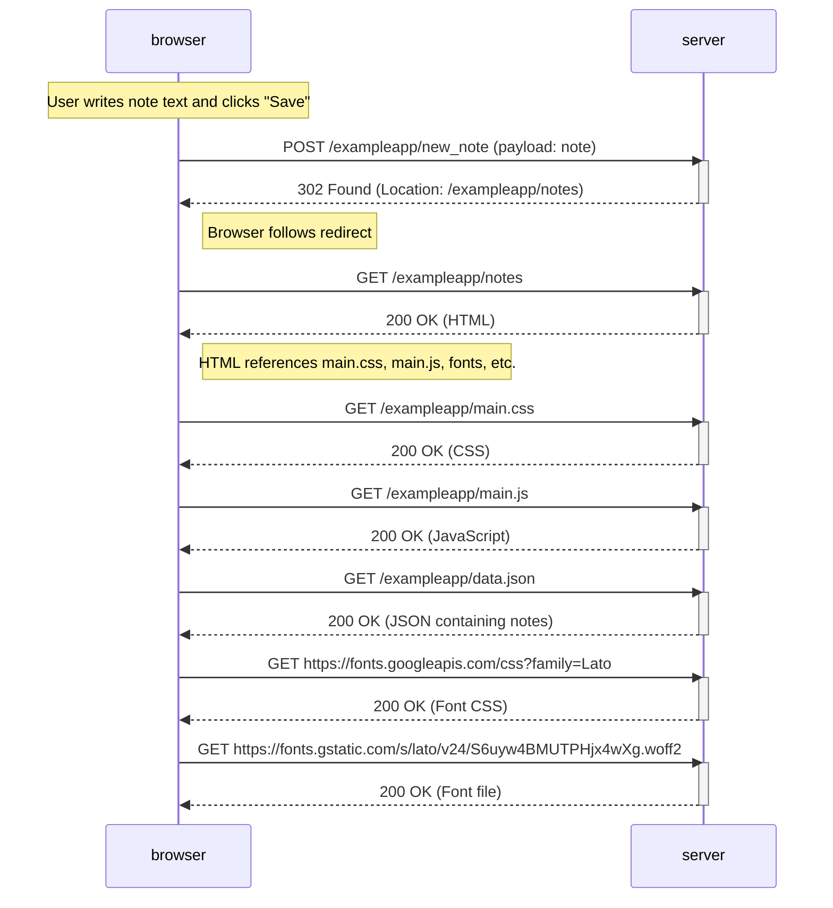

```mermaid
sequenceDiagram
    participant browser
    participant server

    Note over browser: User writes note text and clicks "Save"

    browser->>server: POST /exampleapp/new_note (payload: note)
    activate server
    server-->>browser: 302 Found (Location: /exampleapp/notes)
    deactivate server

    Note right of browser: Browser follows redirect

    browser->>server: GET /exampleapp/notes
    activate server
    server-->>browser: 200 OK (HTML)
    deactivate server

    Note right of browser: HTML references main.css, main.js, fonts, etc.

    browser->>server: GET /exampleapp/main.css
    activate server
    server-->>browser: 200 OK (CSS)
    deactivate server

    browser->>server: GET /exampleapp/main.js
    activate server
    server-->>browser: 200 OK (JavaScript)
    deactivate server

    browser->>server: GET /exampleapp/data.json
    activate server
    server-->>browser: 200 OK (JSON containing notes)
    deactivate server

    browser->>server: GET https://fonts.googleapis.com/css?family=Lato
    activate server
    server-->>browser: 200 OK (Font CSS)
    deactivate server

    browser->>server: GET https://fonts.gstatic.com/s/lato/v24/S6uyw4BMUTPHjx4wXg.woff2
    activate server
    server-->>browser: 200 OK (Font file)
    deactivate server
```