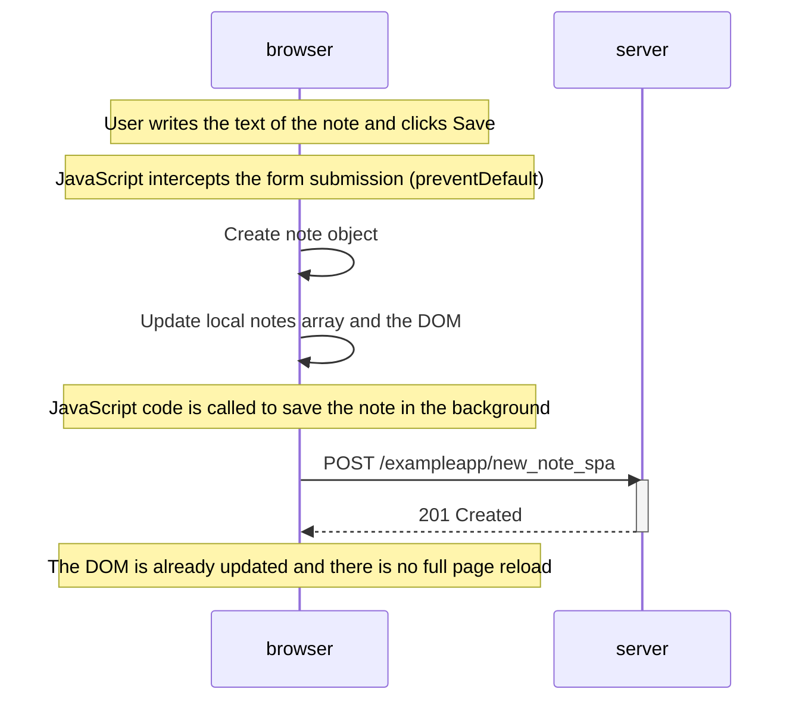

```mermaid
sequenceDiagram
    participant browser
    participant server

    Note over browser: User writes the text of the note and clicks Save
    
    Note over browser: JavaScript intercepts the form submission (preventDefault)
    browser->>browser: Create note object
    browser->>browser: Update local notes array and the DOM
    
    Note over browser: JavaScript code is called to save the note in the background 
    
    browser->>server: POST /exampleapp/new_note_spa
    activate server
    server-->>browser: 201 Created
    deactivate server

    Note over browser: The DOM is already updated and there is no full page reload

```