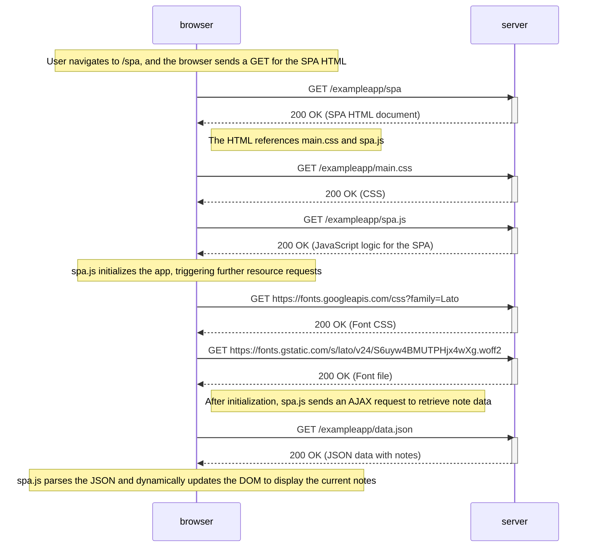

```mermaid
sequenceDiagram
    participant browser
    participant server
    
    Note over browser: User navigates to /spa, and the browser sends a GET for the SPA HTML
    
    browser ->> server: GET /exampleapp/spa
    activate server
    server -->> browser: 200 OK (SPA HTML document)
    deactivate server
    
    Note right of browser: The HTML references main.css and spa.js
    
    browser ->> server: GET /exampleapp/main.css
    activate server
    server -->> browser: 200 OK (CSS)
    deactivate server
    
    browser ->> server: GET /exampleapp/spa.js
    activate server
    server -->> browser: 200 OK (JavaScript logic for the SPA)
    deactivate server
    
    Note over browser: spa.js initializes the app, triggering further resource requests
    
    browser ->> server: GET https://fonts.googleapis.com/css?family=Lato
    activate server
    server -->> browser: 200 OK (Font CSS)
    deactivate server
    
    browser ->> server: GET https://fonts.gstatic.com/s/lato/v24/S6uyw4BMUTPHjx4wXg.woff2
    activate server
    server -->> browser: 200 OK (Font file)
    deactivate server
    
    Note right of browser: After initialization, spa.js sends an AJAX request to retrieve note data
    
    browser ->> server: GET /exampleapp/data.json
    activate server
    server -->> browser: 200 OK (JSON data with notes)
    deactivate server
    
    Note over browser: spa.js parses the JSON and dynamically updates the DOM to display the current notes
```